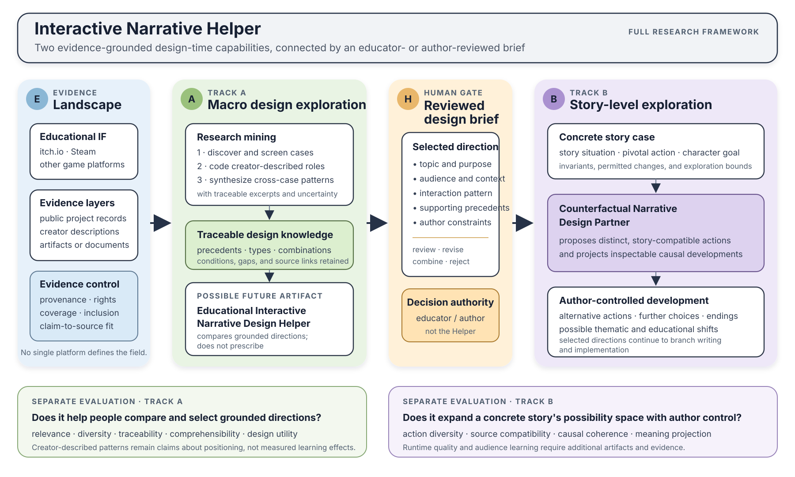
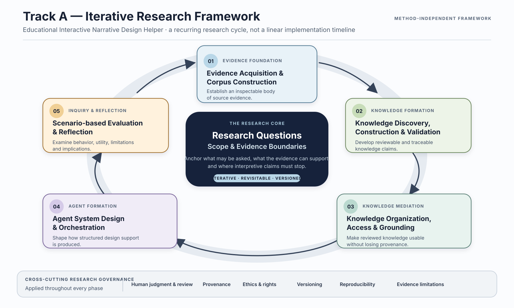

# Interactive Narrative Helper

Interactive Narrative Helper is a research program about evidence-grounded,
design-time AI support for educators and narrative authors.

The program now treats its current and long-term work as two connected
directions:

1. **Macro educational design exploration:** identify how creators describe
   educational purposes, intended audiences, application settings, interactive
   narrative forms, and the relationships among them.
2. **Story-level counterfactual exploration:** help an author expand a concrete
   story by proposing alternative character actions and projecting their
   consequences for later choices, endings, themes, and educational meaning.

These directions belong to the same umbrella Helper but remain separable for
research and evaluation. See
[`research/helper-architecture.md`](research/helper-architecture.md).

## Research frameworks

### Full program framework



The full program begins with educational Interactive Fiction distributed across
game platforms such as itch.io and Steam. Public project records, creator
descriptions, playable artifacts, and supporting documents may contribute
different evidence when a claim requires them. No single platform or source
layer defines the field.

### Current study framework



The current operational study is narrower than the full framework. It uses the
frozen itch.io candidate inventory and public creator project pages as its first
source layer. Steam and other platforms are possible future coverage, not part
of the accepted current acquisition.

## Current research stage

The current short-term goal is to understand how creators describe Interactive
Fiction (IF) for educational and learning contexts. Current work focuses on
population and terminology, source acquisition, inclusion, and the
creator-described educational and interaction characteristics that the
available source material can support.

The detailed knowledge representation, retrieval method, macro Helper contract,
and design-brief schema are deferred until mining shows what can be derived
reliably. Raw project-page HTML is source material for mining, not direct input
to either future Helper capability.

## Story-level long-term research goal

> To what extent can a generative agent act as a counterfactual narrative
> design partner in adapting classic children's stories into multi-ending
> interactive narratives, by proposing distinct yet story-compatible character
> actions and projecting their consequences for plot development, possible
> endings, thematic meaning, and educational purpose?

The long-term story-level track retains the design-time **Counterfactual
Narrative Design Partner** as an ambitious future goal. The current mining stage
does not claim that either Helper direction or a design knowledge base has been
implemented.

## Repository map

| Path | Responsibility |
|---|---|
| `research/` | Research question, constructs, scope, methods, ethics, and decisions |
| `agent/` | Future macro educational-design Helper and story-level counterfactual Partner |
| `cases/` | Stable story analyses, pivotal actions, invariants, and design briefs |
| `corpus/` | Catalogs, annotations, schemas, derived knowledge, and rights records |
| `experiments/` | Reproducible protocols, conditions, evaluations, and analyses |
| `testbeds/` | Runnable research instruments used across experiments |
| `tools/` | Corpus, evaluation, and reporting utilities |
| `outputs/` | Deliberately selected generated figures, tables, and reports |
| `legacy/` | Preserved predecessor implementations(theory-driven narrative ai, credits to ML.Ryan)  |

## Current components and evidence boundary

- `corpus/catalog/itchio-public-text/manifest.json` is a frozen platform-tag
  candidate inventory, not a confirmed educational-IF corpus.
- The explicitly authorized stable 1.0 full-manifest acquisition captured all
  606 candidate project pages, and the stable 1.0 offline cleaner produced 606
  source records. This establishes acquisition and transformation completeness
  for the frozen manifest only; research coding of creator-described purposes,
  audiences, settings, forms, and design relationships has not yet been
  completed.
- `cases/fox-and-crow/` defines the first counterfactual adaptation case without
  prescribing the Agent's answers.
- `testbeds/fox-and-crow/` is the independently versioned playable
  Fox-and-Crow application, included as a Git submodule.
- `legacy/theory-guided-story-generator/` preserves the earlier five-section,
  theory- and Prompt-guided DeepSeek generator. It is prior work, not yet a
  validated baseline for the current research question.

The counterfactual design Agent remains unimplemented. Its existing
machine-readable contracts are preserved under `agent/schemas/` as long-term
work rather than being silently repurposed for the current mining stage.

The confirmed two-direction program structure is recorded in
[`research/decisions/2026-08-28-two-track-helper-architecture.md`](research/decisions/2026-08-28-two-track-helper-architecture.md).

## Clone

Clone the research repository and its testbed together:

```powershell
git clone --recurse-submodules https://github.com/666feiyu666/interactive-narrative-helper.git
```

Existing clones can initialize the testbed with:

```powershell
git submodule update --init --recursive
```

Each executable component owns its own environment and verification commands.
Read its README before running or changing it.

## Working rules

Read `AGENTS.md` before changing research scope, repository structure, data, or
executable behavior. In particular, keep confirmed goals, implemented behavior,
experimental evidence, and interpretation separate; do not commit restricted
source material, secrets, participant data, or unreviewed external corpus
content.
